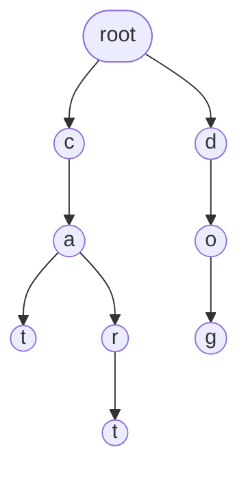

### 什么是Trie树

Trie树（又称前缀树、字典树）是一种用于高效存储和检索字符串集合的树形数据结构。它的核心思想是利用字符串的公共前缀来减少查询时间，最大限度地减少无意义的字符串比较。

例如，我们插入 `cat`、`car`、`cart`、`dog` 四个字符串后，Trie树的结构如下：



### 基本操作

Trie树支持以下基本操作：

- **插入**：将一个字符串插入Trie树中；
- **查找**：判断一个字符串是否在Trie树中，如果存在则求出出现次数；
- **前缀查找**：判断Trie树中以某个前缀开头的字符串的数量。

#### 插入

从根节点开始，逐个字符遍历字符串。对于每个字符，如果对应的子节点不存在，则创建它；然后移动到该子节点。遍历完成后，在最后一个节点上标记为字符串结尾。

#### 查找

从根节点开始，逐个字符遍历字符串。如果某个字符对应的子节点不存在，则字符串不在Trie树中。如果遍历完所有字符，且最后一个节点被标记为字符串结尾，则查找成功。

#### 前缀查找

与查找类似，但不要求最后一个节点被标记为字符串结尾——只要所有字符都能在树中找到对应路径即可。

### 关键代码

```cpp
struct TrieNode
{
    int ch[26];         // 子节点指针，假设只包含小写字母
    int cnt;            // 经过该节点的字符串数量
    int end_cnt;        // 以该节点为结尾的字符串数量
};
TrieNode node[MAXN];    // 节点池
int tot=0;              // 节点总数
void insert(char *s)    // 插入字符串
{
    int u=0;
    for(int i=0;s[i];i++)
    {
        int c=s[i]-'a';
        if(!node[u].ch[c])
        {
            node[u].ch[c]=++tot;
        }
        u=node[u].ch[c];
        node[u].cnt++;
    }
    node[u].end_cnt++;
}

int find(char *s)// 查找字符串出现次数
{
    int u=0;
    for(int i=0;s[i];i++)
    {
        int c=s[i]-'a';
        if(!node[u].ch[c])
        {
            return 0;
        }
        u=node[u].ch[c];
    }
    return node[u].end_cnt;
}

int find_prefix(char *s)// 查找以s为前缀的字符串数量
{
    int u=0;
    for(int i=0;s[i];i++)
    {
        int c=s[i]-'a';
        if(!node[u].ch[c])
        {
            return 0;
        }
        u=node[u].ch[c];
    }
    return node[u].cnt;
}
```

### 时空复杂度

设字符串长度为 $L$，字符集大小为 $\Sigma$。

每一种操作的时间复杂度都是 $O(L)$。

空间复杂度的理论上限为 $O(n \cdot L \cdot \Sigma)$，其中 $n$ 为字符串数量，$L$ 为平均字符串长度。实际使用中，由于公共前缀的存在，空间占用往往远小于理论上限。

### 01Trie

01Trie是Trie的变种，具体思想是将一个数转化为二进制后作为字符串插入Trie树。需要注意，转化后的结果的长度一般需要相同，如不相同则用前导零补全。

01Trie的用途见下方“例题”。

### 例题

#### 1. [Luogu P8306 【模板】字典树](https://www.luogu.com.cn/problem/P8306)

模板题，直接实现Trie树的插入和查询即可。

#### 2. [Luogu P4551 最长异或路径](https://www.luogu.com.cn/problem/P4551)

首先，任意一个数与自己异或结果都是0，任意一个数与0异或结果都是自身。

因此，设 $xor_i$ 为从根节点到节点 $i$ 的路径上所有边权的异或值，则节点 $u$ 到节点 $v$ 的路径异或值为 $xor_u \oplus xor_v$（从根到LCA的部分异或抵消为0）。问题就转化为了：在n个数中寻找2个数，使得它们的异或值最大。

我们将这n个异或值按二进制位插入01Trie，插入过程中计算待插入的数选择哪个已插入的数进行异或可以得到最大异或值，最后求最大值即可。

查询时，从高位到低位逐位贪心：若当前位为0，则优先走向子节点1；若当前位为1，则优先走向子节点0。因为异或运算中不同位结果为1，而我们希望结果的高位尽可能使1，优先走相反位能使结果更大。若相反位的子节点不存在，则只能走相同位的子节点。

### 习题

1. [Luogu P2922 【USACO08DEC】 Secret Cow Code S](https://www.luogu.com.cn/problem/P2922)
2. [Luogu P3879 【TJOI2010】 阅读理解](https://www.luogu.com.cn/problem/P3879)