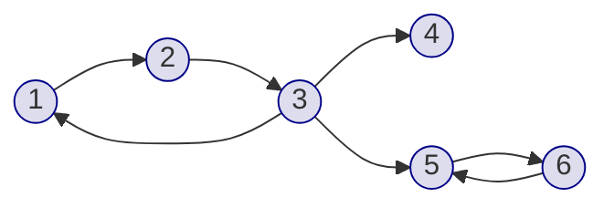

### 什么是强连通分量

给定一张有向图，若图中任意两个点 $u$、$v$，存在一条从 $u$ 到 $v$ 的路径，同时也存在一条从 $v$ 到 $u$ 的路径，则称这两个点是**强连通**的。

如果有向图的一个子图中任意两个点都强连通，则称这个子图为一张**强连通分量**（Strongly Connected Component，简称SCC）。换言之，强连通分量是极大的强连通子图。

例如，在下图中，$1 \rightarrow 2 \rightarrow 3 \rightarrow 1$ 构成一个强连通分量，$4$ 单独构成一个强连通分量，$5 \rightarrow 6 \rightarrow 5$ 构成一个强连通分量：



强连通分量的经典缩点操作（将每个SCC缩成一个点）可以把有向图转化为有向无环图，从而简化问题。

### 引理与证法

在介绍Tarjan算法之前，我们先定义两个数组：

- `dfn[u]`：节点 $u$ 的DFS序，即第几个被访问到；
- `low[u]`：从节点 $u$ 出发，沿着零条或多条**尚未确定所属SCC的边**走，所能到达的最小DFS序。

**关键引理**：在一个强连通分量中，`dfn` 值最小的节点（即DFS最先访问到的那个节点）是SCC的“根”。当DFS回溯到该根节点时，如果 `dfn[u] == low[u]`，那么栈中从栈顶到 $u$ 的所有节点恰好构成一个强连通分量。

**证明**：`dfn[u] == low[u]` 说明从 $u$ 出发，无法走到任何DFS序比 $u$ 更早的节点。而栈中在 $u$ 之后的节点（比 $u$ 晚入栈），都是DFS过程中从 $u$ 的可达子图中遍历到的。由于无法往比自己更早的节点走，这些节点若要互相到达，只能借助 $u$，因此它们和 $u$ 共同构成一个强连通分量。

### Tarjan算法流程

Tarjan算法使用一次DFS遍历整张有向图，维护栈和上述两个数组，流程如下：

1. 从节点 $u$ 开始DFS，设置 `dfn[u] = low[u] = ++nowdfn`，将 $u$ 入栈，标记在栈中；
2. 遍历 $u$ 的所有出边 $(u, v)$：
   - 若 $v$ 尚未访问，则递归访问 $v$，然后用 `low[v]` 更新 `low[u]`；
   - 若 $v$ 已访问且在栈中，则说明 $v$ 和当前SCC在同一搜索路径上，用 `dfn[v]` 更新 `low[u]`；
3. DFS回溯结束时，若 `dfn[u] == low[u]`，说明 $u$ 是一个SCC的根。不断出栈，直到 $u$ 被弹出，弹出的所有节点属于同一个SCC，为它们分配相同的SCC编号。

### 关键代码

```cpp
std::stack<int> stk;        // 维护当前搜索路径上的节点
bool instk[MAXN];           // 标记节点是否在栈中
int dfn[MAXN], low[MAXN];   // DFS序与最小可达DFS序
int nowdfn = 0;             // 当前DFS序计数
int scc[MAXN];              // 每个节点所属的SCC编号
int scc_size[MAXN];         // 每个SCC的大小
int scc_cnt = 0;            // SCC数量

void dfs(int u)
{
    // 1. 初始化u的DFS序和low值，将u入栈
    dfn[u] = low[u] = ++nowdfn;
    visit[u] = true;
    stk.push(u);
    instk[u] = true;

    // 2. 遍历u的所有出边，更新low[u]
    for (int i = head[u]; i; i = edge[i].next)
    {
        int v = edge[i].to;
        if (!visit[v])              // 子节点未访问，递归搜索
        {
            dfs(v);
            low[u] = std::min(low[u], low[v]);  // 用子节点的low值更新u的low值
        }
        if (instk[v])               // 子节点在栈中（尚未确定所属SCC）
        {
            low[u] = std::min(low[u], dfn[v]);  // 用子节点的dfn值更新u的low值
        }
    }

    // 3. 若dfn[u]==low[u]，说明u是SCC的根，弹栈并分配SCC编号
    if (dfn[u] == low[u])
    {
        scc_cnt++;
        while (!stk.empty())
        {
            int v = stk.top();
            stk.pop();
            instk[v] = false;       // 标记不在栈中
            scc[v] = scc_cnt;       // 分配SCC编号
            scc_size[scc_cnt]++;    // 统计SCC大小
            if (v == u)             // 弹出根节点后停止
            {
                break;
            }
        }
    }
}
```

### 时空复杂度

设节点数为 $n$，边数为 $m$。

时间复杂度为 $O(n + m)$，因为每条边只被遍历一次，每个节点只入栈出栈各一次。

空间复杂度为 $O(n)$，用于栈和各个标记数组。

### 缩点

Tarjan算法结束后，我们得到了每个节点所属的SCC编号。接下来可以进行**缩点**操作：将每个强连通分量缩成一个有向无环图中的节点，分量之间的边作为DAG中的边。

缩点的方法很简单：遍历原图中的每条边 $(u, v)$，若 `scc[u] != scc[v]`，则在 `scc[u]` 与 `scc[v]` 之间建一条边。

缩点后的图一定是有向无环图（DAG），可以在拓扑序上进行动态规划或其他操作。

### 例题

#### 1. [Luogu P3387 【模板】缩点](https://www.luogu.com.cn/problem/P3387)

模板题。先用Tarjan求出所有强连通分量进行缩点，然后将每个SCC的权值设为该分量内所有节点权值之和。最后在缩点后的DAG上跑DP求最大权路径。

#### 2. [Luogu P2341 【HAOI2006】 受欢迎的牛](https://www.luogu.com.cn/problem/P2341)

先用Tarjan求出所有强连通分量并缩点。在缩点后的DAG中，若存在明星奶牛，则明星奶牛所在的SCC出度必为0（否则它能到达其他SCC，被它喜欢的奶牛不一定喜欢它）。若出度为0的SCC多于一个，则这些SCC之间互相不喜欢，答案为0；若恰好只有一个出度为0的SCC，则该SCC中所有奶牛都是明星，答案即为该SCC的大小。

### 习题

1. [Luogu P1073 【NOIP 2009 提高组】 最优贸易](https://www.luogu.com.cn/problem/P1073)
2. [Luogu P1262 【POI 1996 R3】 间谍网络](https://www.luogu.com.cn/problem/P1262)
3. [Luogu P2002 消息扩散](https://www.luogu.com.cn/problem/P2002)
