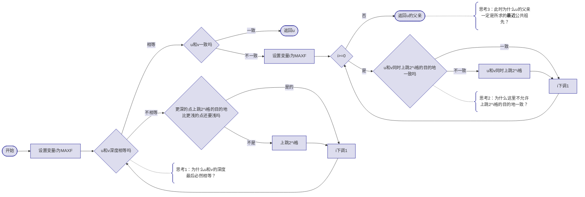

### 什么是最近公共祖先

在一棵有根树上，若点f同时是u与v的祖先，且点f的深度尽可能大（离根最远），则称f为u与v的最近公共祖先。

### 朴素算法

1. 将更深的点上移 $1$ 格。如果点一样深，那就一起上移 $1$ 格；
2. 当u和v相遇时，相遇的点即为f。

预处理时间复杂度 $O(n)$，查询时间复杂度 $O(n)$。

### 优化：倍增上跳

可以发现，朴素算法的时间瓶颈在于上跳。当f和u或v距离比较大时，上跳耗时很大。

类比一下，当你想要从广铁一中去北京天安门，你**可能**会这么做：

1. 走路到杨箕地铁站
2. 坐地铁到广州南站
3. 坐高铁到北京西站
4. 坐地铁到天安门西站
5. 走路到天安门前

而一般人不会从广铁一中直接走到广州南站，也没有办法直接坐高铁到天安门前。

正如步行、地铁、高铁的多级交通，倍增也可以这么类比：上跳的时候，从大到小枚举步长 $2^k$，能跳则跳，最终刚好到达目标。

因此，倍增LCA算法分为预处理和查询两个阶段。

#### 预处理

先定义 `fa[u][i]`为从节点u上跳 $2^i$ 格的目的地。`fa[u][0]`就是u的直接祖先。

这个数组是很好创建的。我们可以使用DFS遍历树上每个节点，并计算这个节点的上跳目的地。

可以发现，上跳一次 $2^i$ 格，就是上跳两次 $2^{i-1}$ 格。所以我们可以列出递推式：```fa[u][i]=fa[fa[u][i-1]][i-1]```。

这样，我们就实现了计算 `fa[u][i]` 数组。特别地，当 `fa[u][i]=0` 时，代表u上跳 $2^i$ 格会跳出树根。

时间复杂度 $O(n\log n)$，空间复杂度 $O(n\log n)$，因为对于每一个点都要计算 $\log n$ 个上跳目的地。

#### 查询

控制上跳的幅度是查询的重点。如果上跳跳到了f的上方，就很难回来了，查询的结果也会变成“公共祖先”而不是“最近公共祖先”了。

因此步骤为：



时间复杂度 $O(\log n)$，因为最多上跳 $O(\log n)$ 次。

#### 思考答案
##### 思考1

假设两个点一开始的深度差为d，d可以转换为一个二进制数。

每次检查更深的点上跳是否会超出更浅的点，便是从高位到低位检查d的某一位是否为 $1$；而执行上跳，便是发现这一位为 $1$ 后，将这个 $1$ 变成 $0$。

最后，二进制数d一定可以变为 $0$，两个点就处在了同一深度。

##### 思考2

因为若目的地一致，无法判断这个目的地是否在最近公共祖先之上。一旦跳到最近公共祖先之上，很难跳回来。

##### 思考3

因为先前的上跳已经跳到了“u和v不相遇”的极限，显然，此时u和v再跳 $1$ 格就相遇了，相遇的这个点就是**最近**公共祖先了。

### 例题

1. [Luogu P3379 【模板】最近公共祖先](https://www.luogu.com.cn/problem/P3379)

最近公共祖先算法只需一道例题即可，因为和树有关的题，有很多都要用到最近公共祖先算法。

### 更快的算法

虽然本文讲解的是倍增求LCA，但建议同学们以后学一下[DFS序求LCA](https://www.luogu.com.cn/article/pu52m9ue)，在搭配ST表的情况下可以把单次查询的时间复杂度从 $O(\log n)$ 降到 $O(1)$，在某些题会大有帮助。