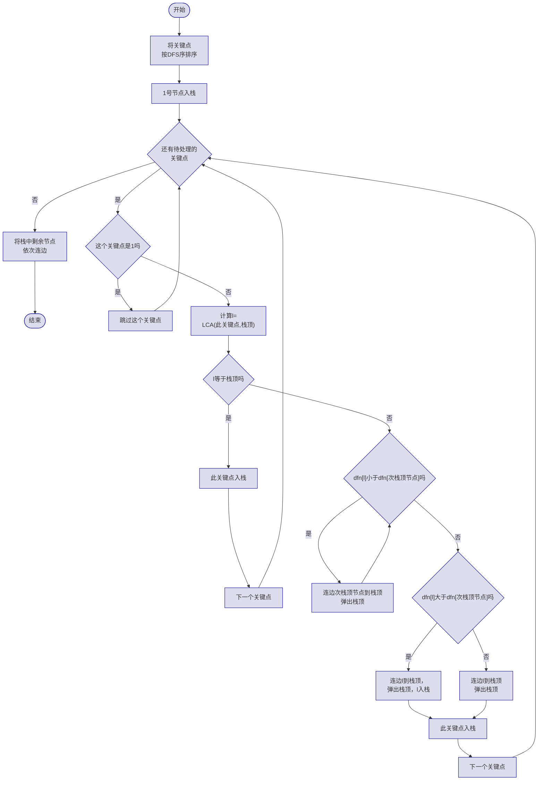

### 什么是虚树

在解决一类树形动态规划问题时，我们经常只需要关注树上的**一部分关键点**，而非整棵树。如果每次都在整棵树上进行DP，时间复杂度会很高。

**虚树**就是一种只包含关键点及其LCA的"压缩树"。它保留了关键点之间的祖先关系，但去除了所有无关节点，从而将问题规模从 $O(n)$ 降到 $O(k)$，其中 $k$ 是关键点的数量。

### 构建虚树：单调栈 + LCA 方法

构建虚树的核心思想是：将所有关键点按照DFS序排序，然后用一个单调栈维护当前虚树的一条链，逐个插入新节点。

#### 算法流程

1. 将所有关键点按DFS序从小到大排序并**去重**；
2. 重置边计数器，清空根节点（1号节点）的邻接表，然后将根节点入栈；
3. 依次处理每个关键点 $h[i]$：
   - 若 $h[i]=1$（即根节点本身是关键点），跳过；
   - 计算 $l = \text{LCA}(h[i], \text{栈顶节点})$；
   - 如果 $l$ 等于栈顶节点，说明 $h[i]$ 在当前栈所存的链上，清空 $h[i]$ 的邻接表后入栈；
   - 否则，需要从栈中弹出节点，直到找到合适的位置连接。具体分为：
     * 当 $dfn[l] < dfn[\text{次栈顶}]$ 时，反复弹出栈顶并与新的栈顶连边；
     * 退出循环后，若 $dfn[l] > dfn[\text{次栈顶}]$，说明 LCA 是第一次出现，清空其邻接表后入栈；
     * 若 $dfn[l] = dfn[\text{次栈顶}]$，说明 LCA 已在栈中，直接弹出栈顶即可。
   - 最后清空 $h[i]$ 的邻接表并将其入栈。
4. 处理完所有关键点后，将栈中剩余节点从栈底到栈顶依次连边。

#### 流程图



#### 代码实现

```cpp
void build()
{
    sort(h + 1, h + k + 1, [](const int x, const int y)
    {
        return dfn[x] < dfn[y];
    });
    k = unique(h + 1, h + k + 1) - h - 1;
    // 去重
    edge_cnt = 0;
    head[1] = 0;
    stk[stk_top = 1] = 1;
    // 1号节点入栈
    for (int i = 1, l; i <= k; ++i)
    {
        if (h[i] != 1)
        {
            // 如果1号节点是关键节点就不要重复添加
            l = lca(h[i], stk[stk_top]);
            // 计算当前节点与栈顶节点的LCA
            if (l != stk[stk_top])
            {
                // 如果LCA和栈顶元素不同，则说明当前节点不在当前栈所存的链上
                while (stk_top > 1 && dfn[l] < dfn[stk[stk_top - 1]])
                {
                    // 当次栈顶节点的DFS序大于LCA的DFS序
                    add_edge(stk[stk_top - 1], stk[stk_top]);
                    add_edge(stk[stk_top], stk[stk_top - 1]);
                    stk_top--;
                }
                // 把与当前节点所在的链不重合的链连接掉并且弹出
                if (dfn[l] > dfn[stk[stk_top - 1]])
                {
                    // 如果LCA不等于次栈顶节点（这里的大于其实和不等于没有区别）
                    head[l] = 0;
                    add_edge(l, stk[stk_top]);
                    add_edge(stk[stk_top], l);
                    stk[stk_top] = l;
                }
                // 说明LCA是第一次入栈，连边后弹出栈顶元素，并将LCA入栈
                else
                {
                    add_edge(l, stk[stk_top]);
                    add_edge(stk[stk_top], l);
                    stk_top--;
                }
                // 说明LCA就是次栈顶节点，直接弹出栈顶元素
            }
            head[h[i]] = 0;
            stk[++stk_top] = h[i];
            // 当前节点必然是第一次入栈，入栈
        }
    }
    for (int i = 1; i < stk_top; ++i)
    {
        add_edge(stk[i], stk[i + 1]);
        add_edge(stk[i + 1], stk[i]);
    }
    // 剩余的最后一条链连接一下
    return;
}
```

#### 关键步骤详解

**步骤1：排序**

将所有关键点按DFS序排序。这保证了在DFS序中靠前的节点（即 $dfn$ 值更小的节点）先被处理。

**步骤2：维护单调栈**

栈中保存的是当前虚树的一条从根到某个节点的链。栈中节点的DFS序严格递增。

**步骤3：处理LCA不等于栈顶的情况**

当LCA不等于栈顶时，说明当前节点 $h[i]$ 不在栈顶节点所在的子树中。此时需要：

1. 从栈中弹出节点，直到次栈顶节点的DFS序不大于LCA的DFS序；
2. 每弹出一个节点，将其与新的栈顶连边（这条边属于虚树）；
3. 判断LCA是否等于次栈顶节点：
   - 若LCA不等于次栈顶节点，说明LCA是第一次入栈，需要将其入栈；
   - 若LCA等于次栈顶节点，直接将栈顶弹出即可。

**步骤4：收尾**

处理完所有关键点后，栈中剩余的节点构成一条链，依次连边即可。

### 例题

#### 1. [Luogu P2495 【SDOI2011】 消耗战](https://www.luogu.com.cn/problem/P2495)

给定一棵 $n$ 个节点的树，边有边权，每次给出 $k$ 个关键点，要求切断一些边使得根节点（1号节点）与所有关键点都不连通，求最小代价。

有时我们需要多次取k个关键点并进行DP。如果每次都在整棵树上DP，单次复杂度为 $O(n)$。但题目有 $m$ 次询问，总复杂度 $O(nm)$ 显然过高。

注意到每次只与 $k$ 个关键点有关，我们可以构建一棵只包含这 $k$ 个关键点以及它们两两之间LCA的虚树，然后在虚树上进行DP。这样单次复杂度降为 $O(k \log k + k \log n)$（若LCA用倍增法）或 $O(k \log k + k)$（若LCA用DFS序+ST表 $O(1)$ 查询）。

虚树构建完成后，设 $dp[u]$ 表示在以 $u$ 为根的子树中，切断所有关键节点的最小代价。

$$dp[u] = \sum_{v \in \text{children}(u)} \min(w(u,v), dp[v])$$

其中 $w(u,v)$ 是原树上 $u$ 到 $v$ 路径的最小边权。如果 $v$ 是关键节点，则 $dp[v] = +\infty$（必须切断与父亲的连边）。

### 习题

1. [Luogu P3233 【HNOI2014】 世界树](https://www.luogu.com.cn/problem/P3233)
2. [Luogu P3320 【SDOI2015】 寻宝游戏](https://www.luogu.com.cn/problem/P3320)
3. [Luogu P4103 【HEOI2014】 大工程](https://www.luogu.com.cn/problem/P4103)