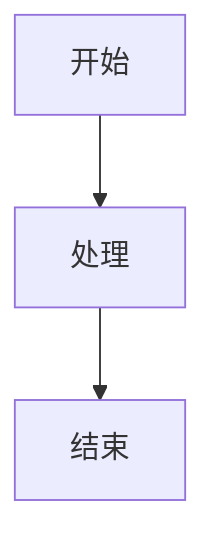

欢迎来到cyrxdzj的博客。

### 技术栈

本博客基于React和Webpack构建，以Ant Design作为组件库，以Cyrx Design作为美术设计。

### 测试内容

以下内容用于测试Markdown渲染器。

#### 标题

# H1
## H2
### H3
#### H4
##### H5
###### H6

#### 段落

这是普通段落。

#### 文字修饰

**加粗** *斜体* ***加粗斜体*** ~~删除线~~

#### 区块引用

> 这是一级引用
>
> > 这是二级引用

#### 列表

- 无序列表
- 无序列表
  - 嵌套无序

1. 有序列表
2. 有序列表
   1. 嵌套有序

#### 代码

`console.log("Hello, World!");`

```javascript
console.log("Hello, World!");
```

#### 链接

[内联链接](https://example.com)
[带标题的链接](https://example.com "标题")

<https://example.com>

#### 图片


#### 表格

| 左对齐 | 居中对齐 | 右对齐 |
|:-------|:--------:|-------:|
| 单元格 | 单元格   | 单元格 |

|无对齐|无对齐|
|----|----|
|1|2|

#### 分割线

---
***

#### 任务列表

- [x] 完成
- [ ] 未完成

#### 脚注

这是一个脚注[^1]。

[^1]: 这是脚注内容。

#### Mermaid图

